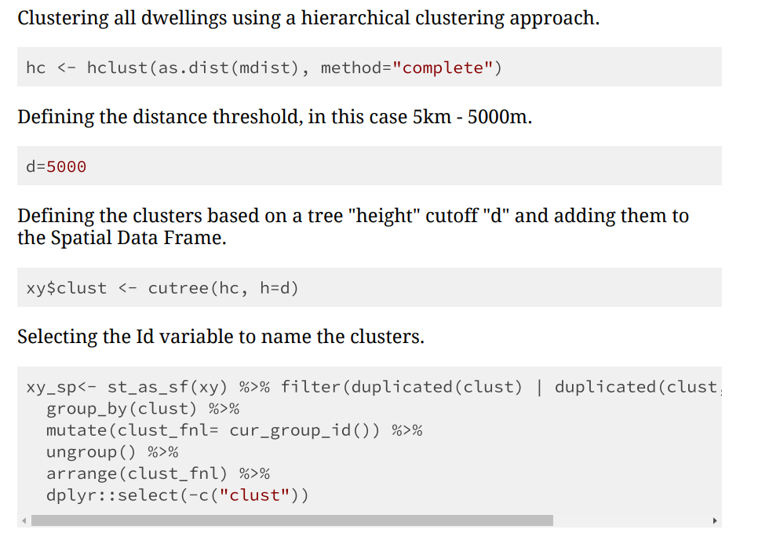
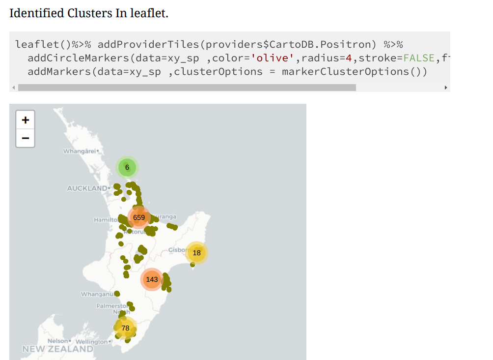

# Airbnb Hierarchical Clustering

# Context

Airbnb has allowed regular people take the space of formal hospitality businesses to offer both short and long term accomodation.[^1]

For government purposes temporal accomodations hosted in residential properties represents a challange since they can not be easily identified as commercial acommodation does. For research purposes while commercial properties can be recognized by using the building consents or business registers hold by the government Airbnb data is out of reach and has a cost since it is owned by a private company.

# Action

It is difficult to access Airbnb data without paying for their API services. Nonetheless, there are certain projects that advocates for Airbnb data to be public such as Inside Airbnb. [^2]

Using Inside Airbnb publicly available data we can identify if Airbnbs are being randomly distributed across New Zealand or if there was a particular concentration in certain areas. There is the potential of also looking into the characteristics of the dwellings that were being clustered to see if these display any particular pattern but this is going to be taken out of scope for this exercise. 

Given that the number of clusters was unknown Hierarchical clustering was chosen as the preferred methodology. Hierarchical clustering is a form of unsupervised learning that helps to draw inferences from unlabeled data. For this particularly agglomerative clustering based on the distance between the Airbnbs it is going to be used to select which dwellings belong to each cluster.

 [^3]

# Overview Methodology

# Overview Results

[^1]: Airbnb https://www.airbnb.co.nz/
[^2]: Inside Airbnb https://insideairbnb.com/
[^3]: Unsplash https://unsplash.com/photos/
